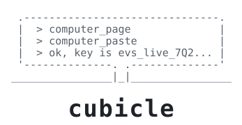
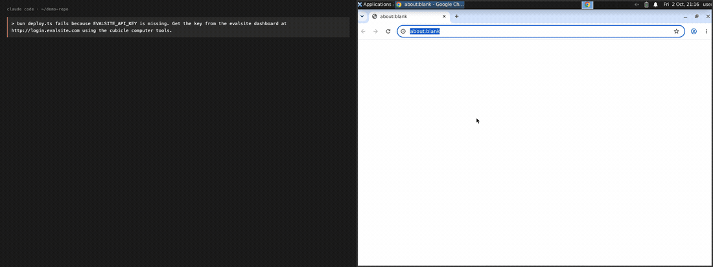

<div align="center">



**A computer for your coding agent. Already logged in as you.**

An MCP server that hands any MCP client a Linux desktop which keeps your sessions
between tasks, fills passwords from 1Password without the model seeing them, and
lets you take over whenever you want.

[](LICENSE)
[](DESIGN.md)
[](https://bun.sh)



</div>

Your agent gets stuck on something it cannot do: sign into SharePoint, click through a
dashboard, copy a value out of a web UI. So you paste a brief into some other
computer-use product, wait, and paste the answer back. You are the integration.

The GIF above is a real run. `bun deploy.ts` fails because an API key is missing, the key
sits behind a login, and the agent signs in and fetches it without you. The form fields
come from the accessibility tree rather than from pixels, and the username, password and
one-time code are typed straight out of 1Password.

## Quickstart

```bash
git clone https://github.com/moritzWa/cubicle && cd cubicle
bun install
echo 'E2B_API_KEY=e2b_...' > .env        # free key at https://e2b.dev
bun bin/cubicle.ts setup                 # builds your computer, about a minute
bun bin/cubicle.ts doctor                # checks everything is in place

claude mcp add cubicle -- bun $PWD/bin/mcp.ts
```

Then ask Claude Code for something behind a login:

> check my Gmail and tell me the subject of the newest email

The first time it will hit a sign-in page. Ask for `computer_takeover`, open the URL,
log in by hand, and every later task starts authenticated.

Setup is a separate command because provisioning a fresh sandbox takes longer than the
60 seconds MCP clients allow for one tool call.

## Tools

| tool | what it does |
|---|---|
| `computer_page` | the URL plus every interactive element with its screen coordinates, read from the accessibility tree |
| `computer_screenshot` | 1024x768 PNG |
| `computer_click`, `computer_type`, `computer_key` | OS-level input, so pages see a real user |
| `computer_navigate` | open a URL |
| `computer_shell` | run a command in the computer |
| `computer_drag` | press, move, release: drag-and-drop, sliders, selecting text |
| `computer_paste` | type a secret into the focused field without the model seeing it |
| `computer_stash_list` | names of locally stashed values, never the values |
| `computer_upload_file`, `computer_download_file` | move files between your Mac and the computer |
| `computer_takeover` | a URL where you drive the same desktop yourself |
| `computer_pause` | save all state, including logins |

## Secrets

```bash
# from 1Password, matched against the page's domain
computer_paste({ from: "1password", field: "password" })

# from anything you stash locally
cubicle stash ssh_pub --file ~/.ssh/id_ed25519.pub
computer_paste({ from: "stash", name: "ssh_pub" })
```

The value travels from your Mac into the computer over the file API, gets typed with
`xdotool`, then shredded. It never lands in a command line, a log, or a model's context.
The agent only handles the name.

A paste is refused when no 1Password item matches the page's registrable domain, when
the focused element is not a text field, and when a password would go anywhere that is
not a password field. A locked vault comes back as `needs_human` rather than hanging.

## How it works

The computer is an [E2B](https://e2b.dev) desktop sandbox running Ubuntu, Xfce and real
Google Chrome. Between tasks the whole machine is paused, RAM and disk, so logins survive
and idle time is free. Resuming takes about a second.

It pauses itself after 90 seconds without a tool call. That is for correctness rather
than cost: a sandbox that reaches its own timeout silently reverts to the last explicit
pause, and nothing raises an error.

Chrome publishes its interface over AT-SPI, so `vmagent/accessibility.py` can read the
focused tab's URL, the focused element and every field with its coordinates. Input goes
through `xdotool` against the X display, never CDP or automation flags, which keeps
`navigator.webdriver` false and sign-in pages well behaved.

## Does it work

Three benchmarks and a login, **38 of 41 tasks passed**, all of it reproducible from
this repo.

Start with the login, end to end, which is the run in the GIF:

```bash
bun test/e2e-login.ts   # deploys a test site into the computer, signs in, exits 0 on success
```

And [MiniWoB++](https://github.com/Farama-Foundation/miniwob-plusplus), 130 browser
tasks with scored rewards, driven by Claude Code through these tools and nothing else:

```bash
bun evals/setup-miniwob.ts    # once: clone the tasks into the computer, serve them
bun evals/miniwob.ts          # 24 tasks, about 20 minutes
bun evals/miniwob.ts click-pie,terminal,drag-items
```

**22 of 24 passed**, median 46 seconds per task, on Claude Opus 5 with no screenshots
needed for most of them:

| | |
|---|---|
| passed | click-button 0.97, enter-text 0.96, click-checkboxes 0.96, click-tab-2 0.96, login-user 0.96, use-autocomplete 0.96, click-dialog-2 0.97, simple-algebra 0.96, click-pie 0.96, drag-items 0.96, copy-paste 0.96, count-shape 0.96, use-slider 0.95, tic-tac-toe 0.95, scroll-text 0.94, click-collapsible-2 0.90, enter-date 0.86, click-shades 0.67, choose-date-easy 0.63, terminal 0.58, search-engine 0.55, guess-number 0.27 |
| failed | book-flight (long multi-step booking; hard for every agent), email-inbox-forward-nl (solved, but reward 0.16 after the time penalty) |

Rewards are time-scaled, so a low score means slow rather than wrong.

And [WebVoyager](https://github.com/MinorJerry/WebVoyager), the same thing on live
websites, where a second Claude call grades the answer against the final screenshot:

```bash
bun evals/webvoyager.ts
bun evals/webvoyager.ts "GitHub--0,ESPN--0"
```

**9 of 10 passed**: arXiv, Wolfram Alpha, Hugging Face, GitHub, BBC News, Apple, ESPN,
Google Search, Coursera. The failure is Cambridge Dictionary, which serves a Cloudflare
challenge. That is what `computer_takeover` is for: solve it once by hand and the
session persists.

And a desktop set, because none of the above leaves the browser:

```bash
bun evals/desktop.ts
```

**7 of 7 passed**: create a folder and rename a file in Thunar, type and save in
Mousepad, open the Terminal app and make a file with it, extract a zip with the
graphical archive manager, build a sum in LibreOffice Calc and save it as CSV, and
chmod +x through Thunar's Properties dialog. The agent is given every tool except
`computer_shell`, so it has to drive the GUI; setup and checking run over the shell
from the harness, so each task is pass/fail with no judge.

The evals paid for themselves: they found five real bugs, all fixed. `computer_page`
ignored div-built UIs, leaked the browser's own toolbar into the page listing, and
repeated each piece of text once per node down the tree. There was no way to drag.
And `computer_navigate` slept a fixed three seconds, so slow pages were read
half-loaded and reported as down.

The three failures: one Cloudflare challenge, one long multi-step flight booking, and
one task solved so slowly the time-scaled reward fell to 0.16.

## What this is not

There is no agent loop here. Cubicle is the computer; your MCP client does the thinking.
There is no hosted service and no account. You run it with your own keys.

`DESIGN.md` has the designed-but-unbuilt parts: a backend loop so tasks outlive a closed
laptop, a takeover page with an "I'm done" button, swapping the Python accessibility
agent for [cua-driver](https://github.com/trycua/cua), a `run_js` tool that batches many
actions into one model turn, and Chrome profile hydration to drop the E2B dependency.

## Things that cost me a day

- A sandbox id is a credential. `https://6080-<id>.e2b.app/vnc.html` serves the live
  desktop with no auth.
- The sandbox timeout loses data. It reverts to the last pause and `connect()` still
  succeeds, so nothing looks wrong.
- Chrome joins the accessibility tree only if it starts after the a11y bus, with
  `--force-renderer-accessibility`. Otherwise the tree is empty and nothing says why.
- noVNC cannot read your Mac's clipboard. Syncing it with `xclip` fails too, because the
  X clipboard lives inside whichever process owns it, so replacing `xclip` empties it.
  Type values in instead.
- `pkill -f foo` matches the shell that is running it. Kill by port.
- Google did not flag the datacenter IP. A fresh profile over VNC got the usual passkey
  prompt and a new-sign-in email, nothing more.
- The desktop image autostarts a screensaver that blanks the screen to black, which
  looks exactly like a broken stream.

## Layout

```text
bin/mcp.ts                the MCP server
bin/cubicle.ts            setup, doctor, stash
src/                      computer lifecycle, VM control, accessibility, 1Password, stash
vmagent/accessibility.py  runs inside the computer, reads the AT-SPI tree
evalsite/                 a login site with TOTP, for deterministic tests
test/e2e-login.ts         the full login, through MCP
DESIGN.md                 decisions, risks, what the experiments showed
```

Apache-2.0.
